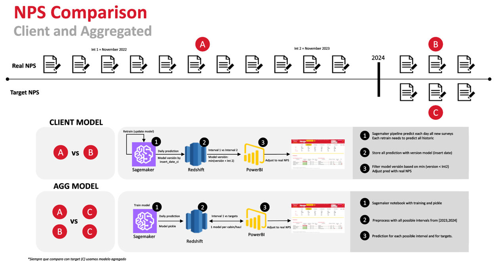
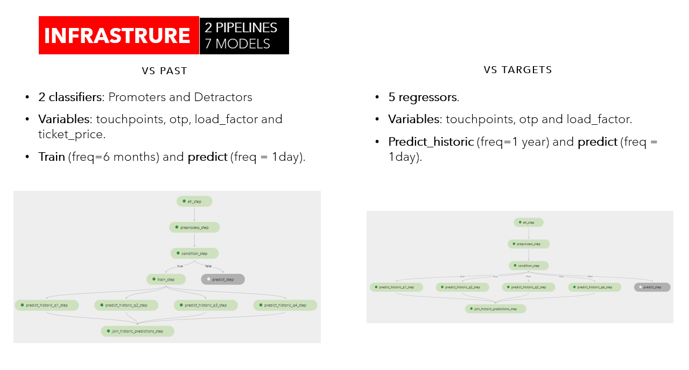
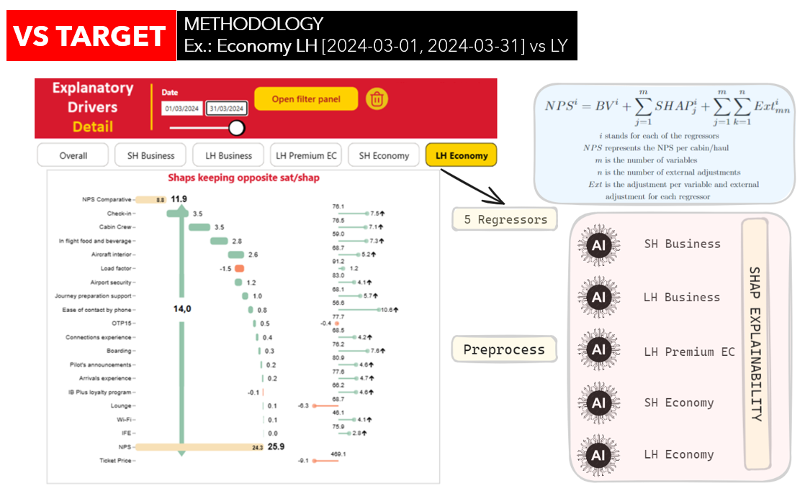
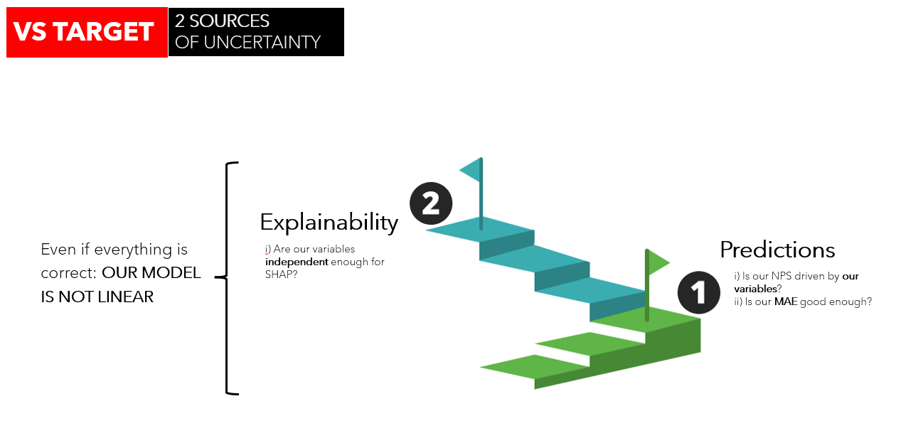

# AI Explanatory Drivers - VS Target Pipeline
The VS Past Pipeline is part of the broader AI Explanatory Drivers tool.

## Methodology

The VS Target pipeline differs from the VS Past pipeline by utilizing five regressors instead of two classifiers. Each regressor corresponds to a different cabin/haul. These regressors are trained on an aggregated level, meaning they are trained on samples of clients using aggregated variables (satisfactions) to directly forecast the NPS of those samples, rather than on a client level.

This approach allows for highly probable NPS estimations for a given set of satisfactions without needing to know the exact sample of clients that generate them. However, since the models operate on an aggregated level, more fine-grained predictions at different stages of aggregation (such as routes, countries, etc.) are not possible.

## Explainability with Shapley Values

The tool uses Shapley values to explain each prediction for the regressors. The Shapley values output values in the logistic space, so an inv_logistic transformation is applied to convert them into the probabilistic space. Although this is not mathematically exact, it is the standard procedure in the industry.

For each sample, the difference in base values for all regressors is taken as the "base NPS value," and the difference in Shapley values per variable is associated with an "NPS Shap value." The logic is simple, and since the operations are linear, it can be considered correct.

To compute the explainability of the NPS for a sample, the NPS base value is taken and each NPS Shap value is averaged separately.

## Sources of Uncertainty

## Goal

The end goal of the VS Target pipeline is to provide NPS estimations based on aggregated satisfaction variables. This method enables businesses to forecast NPS for various satisfaction levels without needing detailed client-level data, allowing for strategic planning and insights. 

