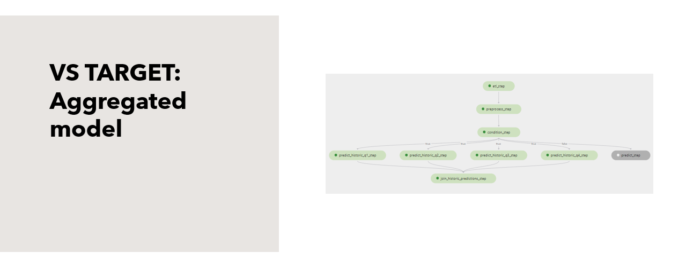
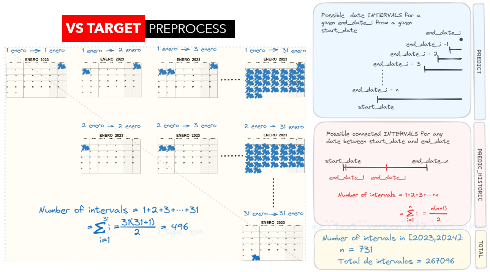
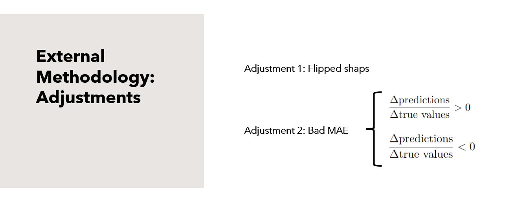
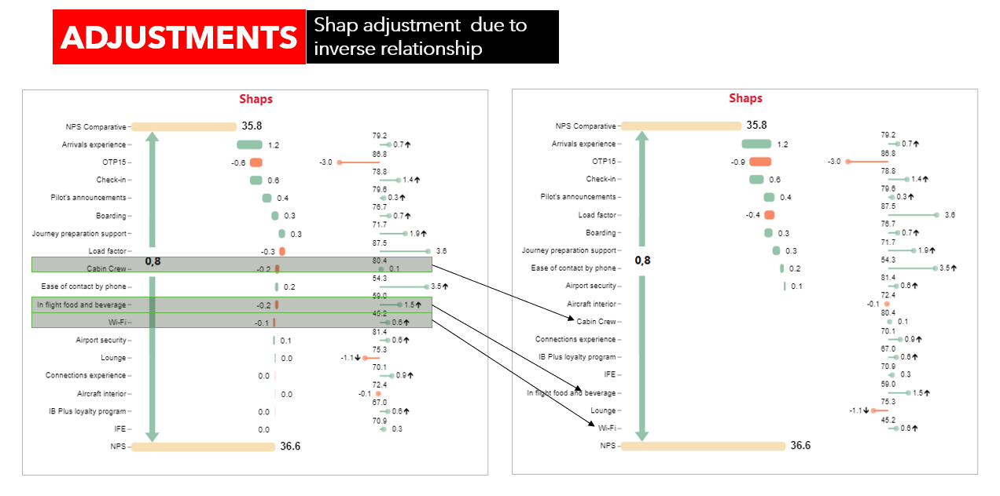
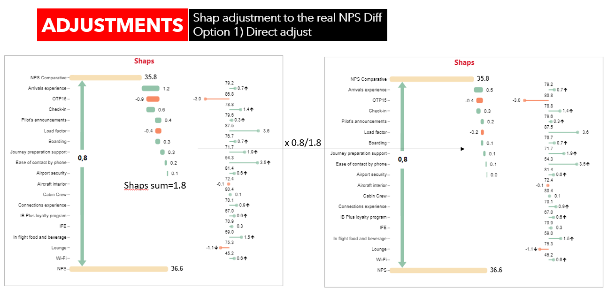
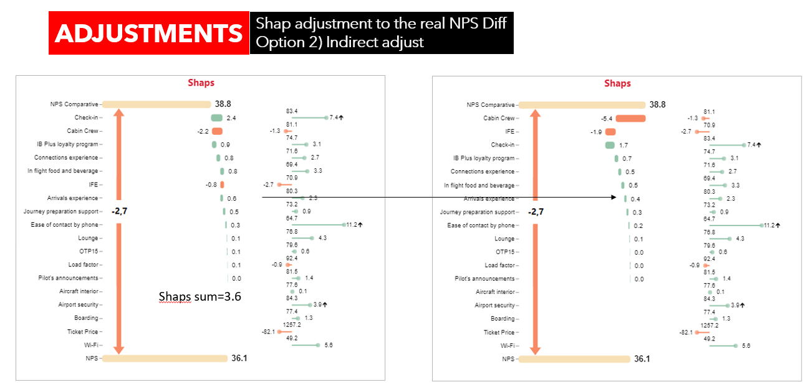

# AI Explanatory Drivers - VS Target Pipeline
The VS Past Pipeline is part of the broader AI Explanatory Drivers tool.

## Methodology

The VS Target pipeline differs from the VS Past pipeline by utilizing five regressors instead of two classifiers. Each regressor corresponds to a different cabin/haul. These regressors are trained on an aggregated level, meaning they are trained on samples of clients using aggregated variables (satisfactions) to directly forecast the NPS of those samples, rather than on a client level.

This approach allows for highly probable NPS estimations for a given set of satisfactions without needing to know the exact sample of clients that generate them. However, since the models operate on an aggregated level, more fine-grained predictions at different stages of aggregation (such as routes, countries, etc.) are not possible.

## Explainability with Shapley Values

The tool uses Shapley values to explain each prediction for the regressors. Since the models are regressors, the shapley values come out as values on the NPS space, which makes them more easy to manage than with classifiers.

## Productionalization

The end goal of the VS Target pipeline is to provide NPS explanations against the given targets for any preriod of time. The challenge here is to have a productionalizable way of computing every single satisfaction, for any given period of time, so an NPS prediction can be made with the regressors and be compared with the targets prediction. 

## Explanation of difference as a difference in explanations.

As with the VS Past pipeline, the main assumption is that the explanation of the difference in NPS between any period of time and the targets is somehow hidden in the difference (not in a mathematical sense) in each of the NPS predictions. For now, the mathematical difference is taken as a proxy to extract this information.

After computing the NPS and its explainability with the above procedure for any period of time and for the targets, the result of subtracting the Shapley values separately is taken as the explanation of why the NPS changed. Notice that because the models remain the same, when the base values of both samples are subtracted, they cancel out.

One thing that is quickly noticeable using this approach is how, due to both the non-linear nature of the model and the uncertainty in the explanations, there are sometimes variables that have a positive change and are known to have a positive impact but are counterintuitively translated into negative Shapley values.

## Sources of Uncertainty

## Adjustments
Building a data analysis tool requires careful consideration of the needs and desires of the business teams that will use it. Therefore, addressing and either explaining or adjusting for MAE and flipped values is essential. Various adjustments are proposed to achieve this.

There are three adjustments:

### 1) Flipped Shaps Adjustment
This adjustment involves setting the Shapley value to 0 if there is a flipped value and then distributing the missed contribution among the Shapley values with the same sign.

### 2.0) MAE Adjustment: Direct
This is a basic normalization that aligns the predictions with the actual NPS value by normalizing the Shapley values.

### 2.1) MAE Adjustment: Indirect
When there is a flip in the sign of the difference between predictions and actual values, this extreme adjustment is implemented. It shrinks the values of the proper sign and stretches the values of the opposite sign.

